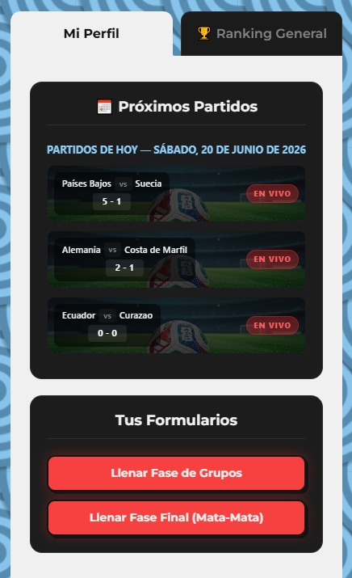
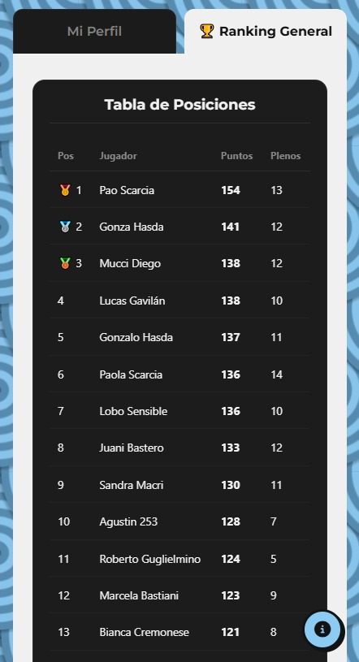
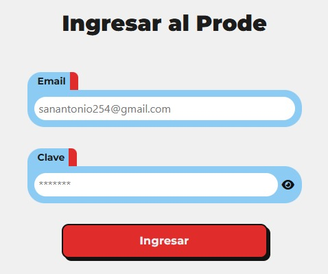
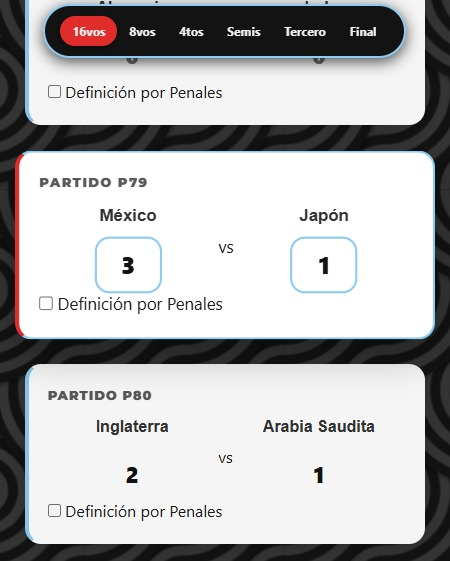
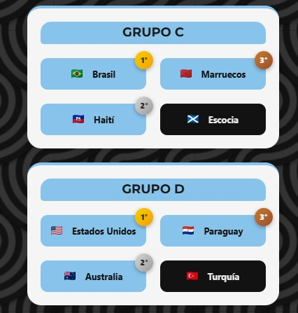
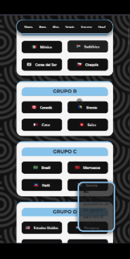

# 🏆 Prode Mundial 2026


Plataforma web interactiva de predicciones deportivas (Prode) para el Mundial 2026. Los usuarios pueden predecir resultados de la Fase de Grupos y la Fase Eliminatoria (Mata-Mata), con un ranking global en tiempo real impulsado por vistas de PostgreSQL.

[🔗 Ver la aplicación en vivo](https://prode254.vercel.app/)

---

## 📸 Capturas de Pantalla

<div align="center">
  
  
  
  
  
  
  <br><em>Demo animada del flujo completo</em>
</div>

---

## 🚀 Características Principales

- **Modo Demo Público:** Cualquiera puede explorar la plataforma sin registrarse. Los formularios están siempre habilitados, pero no se persisten datos en la base de datos.
- **Fase de Grupos:** Formulario dinámico donde el usuario selecciona 3 países (además de Argentina) para predecir sus 6 partidos de grupo.
- **Bracket Dinámico (Mata-Mata):** Selección visual de clasificados por grupo (1.º, 2.º y 3.º) que genera automáticamente los cruces de 16vos, 8vos, cuartos, semis y final, con manejo de penales.
- **Ranking en Tiempo Real:** Tabla de posiciones con scoring granular: 6 pts (perfecto con penales), 5 pts (resultado exacto), 3 pts (diferencia de goles), 2 pts (ganador).
- **Mobile-First:** Interfaz completamente responsiva con CSS variables, Flexbox y Grid.
- **Sin dependencias de frameworks:** Frontend vanilla JavaScript, sin React, Vue ni librerías externas pesadas.

---

## 🛠️ Stack Tecnológico

| Capa | Tecnología |
|------|-----------|
| Frontend | HTML5, CSS3, Vanilla JavaScript ES6+ |
| Backend & DB | Supabase (PostgreSQL con Triggers y Views) |
| Hosting | Vercel (cleanUrls, SPA routing) |
| Automación | Make.com + Gmail API (notificaciones) |
| Iconos | Font Awesome Kit |
| Fuentes | Google Fonts (Montserrat) |

---

## 🧠 Desafíos Técnicos y Soluciones

1. **Cálculo masivo de puntos:** Se delegó la lógica de puntuación a una **Vista SQL (`ranking_prode`)** y **Triggers** en PostgreSQL, evitando bucles costosos desde el frontend.
2. **Bracket auto-generado:** El fixture eliminatorio se construye en JavaScript puro a partir de la selección de clasificados del usuario, con progresión automática de ganadores y manejo de llaves de perdedores (3.er puesto).
3. **Integridad de IDs:** Los 32 partidos de mata-mata y los 72 de grupos comparten la misma tabla `predicciones`. Se usa un sistema de mapeo por rango de IDs para evitar colisiones y determinar la fase correcta.
4. **Bloqueo por tiempo:** Validación cruzada Frontend + Base de Datos que impide guardar pronósticos de partidos ya comenzados.

---

## 💻 Instalación Local

```bash
git clone https://github.com/JBelloWeb/prode-mundial-254.git
cd prode-mundial-254
```

No requiere instalación de dependencias. Abrí `index.html` en un navegador o servilo con cualquier servidor estático:

```bash
npx serve .
```

> **Nota:** El proyecto depende de Supabase para lecturas (ranking, partidos, resultados). Las credenciales de anon key están incluidas en el código para acceso público de solo lectura. Las escrituras están deshabilitadas en modo demo.

---

## 📬 Contacto

[](https://linkedin.com/in/juanbello-dev)
